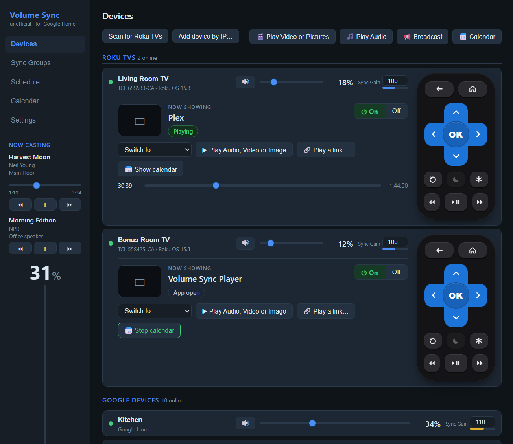
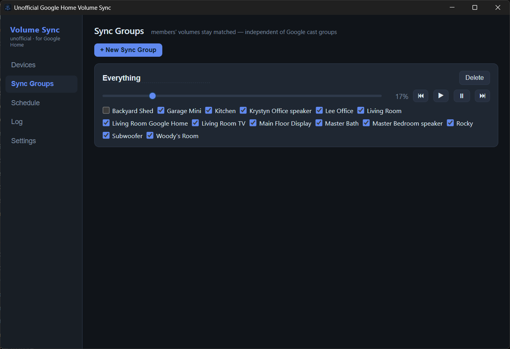
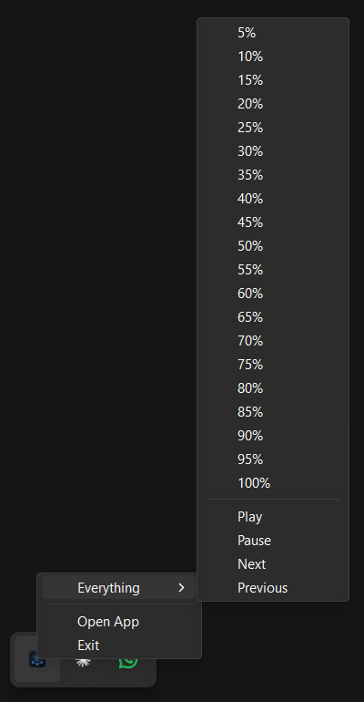
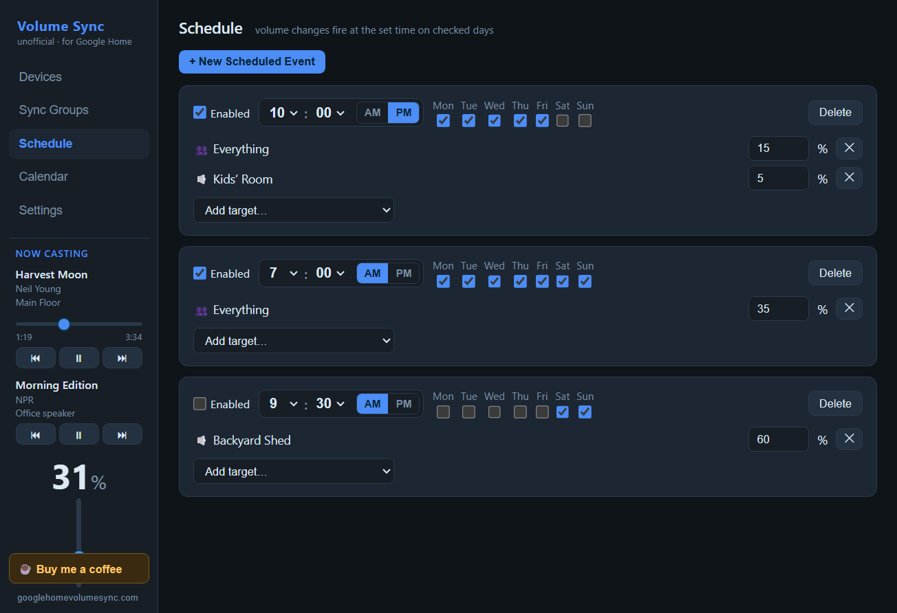
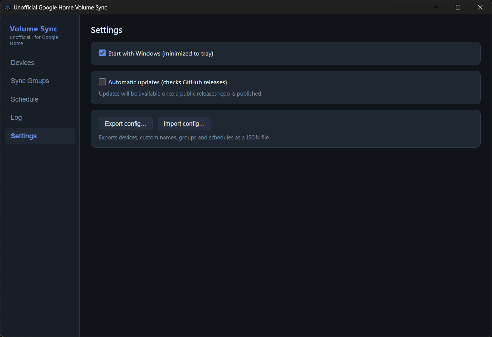

# Unofficial Google Home Volume Sync

**Website: [googlehomevolumesync.com](https://googlehomevolumesync.com)** &nbsp;&middot;&nbsp; **[Download for Windows](https://github.com/leecyrille/GoogleHomeVolumeSync/releases/latest/download/GoogleHomeVolumeSync-setup.exe)** &nbsp;&middot;&nbsp; **[&#9749; Buy me a coffee](https://pactotech.com/products/google-home-volume-sync-tip-jar)**

A Windows desktop app (Tauri 2, pure Rust backend) that discovers Google Cast devices on your LAN and gives you per-device and per-group volume control — fully local, no cloud APIs.

## Screenshots

Every speaker on the network, with live volume sliders and a per-device Sync Gain for balancing rooms:



Sync groups keep their members' volumes matched — change one anywhere and the rest follow:



Right-click the tray icon to set a whole group in 5% steps without opening the app:



Weekly schedules quiet the house on your terms, and settings keep it starting with Windows:





## Features

- **Auto-discovery** of all Google Cast devices (Home/Nest speakers, Chromecasts, cast-enabled TVs, cast groups) via continuous mDNS browsing — new devices just appear.
- **Per-device volume sliders** with live updates (changes made on the speaker or in the Google Home app reflect immediately).
- **Sync groups**: put any devices in a group and control them with one slider; if one member's volume changes — in the app, in the Google Home app, or on the speaker itself — the others are forced to match.
- **Sync Gain** (0–200% per device): balance rooms against each other. A device at 50% gain sits at half the group's level and reports its own changes back at double, so groups stay consistent while quiet or loud rooms are corrected.
- **Now Casting** in the sidebar: track, artist and artwork for whatever is casting, with play / pause / next / previous and a vertical volume slider per sync group involved (collapses to one averaged slider when more than six are in play).
- **Cast media**: play video or music files from your PC, or a link, on any Google Cast device (video on Nest Hubs and Chromecasts, music on speakers and groups), with queues, subtitles from a matching .srt/.vtt, and a draggable progress bar. Show pictures on Nest Hubs, Chromecasts and Roku TVs; several become a slideshow. Roku TVs can do the same after a one-time developer-mode setup that installs a small player channel. **Play Video or Pictures** and **Play Audio** let you tick several devices at once (Roku TVs, Google screens, speakers and speaker groups are listed separately) and play in sync; the app warns when a mix, like a Roku TV with Google speakers, can't stay exactly in step and offers to drop the odd ones out. Files are served only to the devices you pick, for 12 hours.
- **Synced playback**: play one video or music file on several Google Cast devices and Roku TVs at once. Pausing, resuming or skipping on any one of them is copied to the others, and a device that drifts ahead is paused for exactly its lead so they line up again.
- **Calendar on TV**: a family wall calendar (the [PactoTech Calendar Saver](https://calendarsaver.com/) design, built in) on Roku TVs, Nest Hubs and Chromecasts: your Google/Outlook/iCloud calendars (secret iCal links), a photo collage from your folders and a big clock. Month, week and day views (Up/Down on a Roku remote switches them, or they rotate on a timer), light or dark, and a text size per screen so a 5" display is as readable as a 55" TV. Real 4K on Roku TVs. Use it as a Roku screensaver, show it from each TV's card or the tray menu, or schedule it (e.g. weekdays 7:00 for 1½ hours in light mode): it can turn the TV on, wait for a show to finish, and turn the TV off afterwards or when nobody touches the remote. Your calendars are copied from the Calendar Saver if you have it. The calendar is redrawn on this PC every minute, so the PC needs to be on.
- **Broadcast**: type a message and it's spoken (a Windows voice, after a chime) on the Google speakers and groups you pick: whatever's playing pauses, the message plays at your broadcast volume, then every volume goes back and anything this app was playing carries on. Spotify and other apps close on those speakers during the message, and the app tells you where to press play again.
- **Play queue**: pick several files or a whole folder, drag them into order, and see or change the queue on the device's card.
- **Scheduler**: weekly events (day-of-week checkboxes + time) that set volumes on devices or groups; each event has an enable checkbox.
- **System tray**: right-click to see what's playing and control it, and set a sync group's volume in 5% steps (straight in the first menu when you have one sync group). Open App / Exit. Close button hides to tray.
- **Custom names** for devices and groups.
- **Last seen** shown for devices offline >1 day, with a delete option (they re-add when seen again).
- **Config export/import** (JSON).
- **Full logging** of discoveries, observed changes and sent commands — always with cast UUIDs, IPs and names — to `%APPDATA%\GoogleHomeVolumeSync\logs\`.
- **Start with Windows** (login autostart, starts hidden in tray).
- **Optional auto-updates** from GitHub releases.

### Additional device backends

| Backend | Discovery | Volume | Hardware tested | Notes |
|---|---|---|---|---|
| Google Cast | automatic (mDNS) | absolute | yes | primary backend |
| Roku TV | "Scan for Roku TVs" (SSDP) | pseudo-absolute | yes | volume emulated via keypress ramping with a cached level (Recalibrate re-zeros); power on/off with wake-on-LAN fallback, input switching and an on-screen remote |
| Yamaha MusicCast (e.g. RX-V581) | add by IP | absolute | **no** | Yamaha Extended Control JSON API |
| LG webOS TV | add by IP | absolute | **no** | one-time on-screen pairing prompt |
| Optoma projector | add by IP | absolute (0–10 range) | **no** | RS-232-over-Telnet, experimental |

The Yamaha MusicCast, LG webOS and Optoma backends are written to their published protocols but have **not been tried against real hardware** — expect them to need fixes on first use. Bug reports from anyone who owns these are very welcome. The Roku backend has been tested and works.

## Support the project

This app is free and open source, built by one person. If it made your house sound better, a small tip keeps it that way: **[Buy me a coffee](https://pactotech.com/products/google-home-volume-sync-tip-jar)** (tip jar on the Pacto Tech store, pick any amount).

## Credits

This app stands on a lot of open-source work. The main pieces:

- [Tauri](https://tauri.app) for the desktop shell, installer and updater
- [Tokio](https://tokio.rs), [Serde](https://serde.rs), [reqwest](https://github.com/seanmonstar/reqwest), [tungstenite](https://github.com/snapview/tungstenite-rs), [tracing](https://github.com/tokio-rs/tracing) and [chrono](https://github.com/chronotope/chrono)
- [mdns-sd](https://github.com/keepsimple1/mdns-sd) for finding Cast devices, [prost](https://github.com/tokio-rs/prost) for the Cast wire format, [rustls](https://github.com/rustls/rustls) and [native-tls](https://github.com/sfackler/rust-native-tls) for the encrypted connections
- The Google Cast message definition mirrors Chromium's `cast_channel.proto` (BSD-3-Clause, The Chromium Authors)
- Roku control follows Roku's published [External Control Protocol](https://developer.roku.com/docs/developer-program/dev-tools/external-control-api.md) documentation
- Casting files and links, queues and subtitles were inspired by [Web Video Caster](https://www.webvideocaster.com/). Volume Sync isn't affiliated with it and uses none of its code.

Every component shipped in the app, about 360 in total, is listed with its full license text in [THIRD-PARTY-NOTICES.txt](THIRD-PARTY-NOTICES.txt). The app also shows it under **Settings → View all licenses**. Regenerate it with `python tools/gen_notices.py` after changing dependencies.

## Development

```
npm install
npm run tauri dev
```

Requires Rust (MSVC toolchain) and Node.

## Building the installer

```
npm run tauri build
```

Produces an NSIS `.exe` installer under `src-tauri/target/release/bundle/nsis/` (per-user install, no admin needed).

Update signing: the updater public key is in `tauri.conf.json`; the private key lives outside the repo (`~/.tauri/ghvs.key`). Release artifacts for auto-update are published to a public releases repo as `latest.json` + signed installers.

## Config & logs

- Config: `%APPDATA%\GoogleHomeVolumeSync\config.json`
- Logs: `%APPDATA%\GoogleHomeVolumeSync\logs\volume-sync.log.*` (daily rolling)
